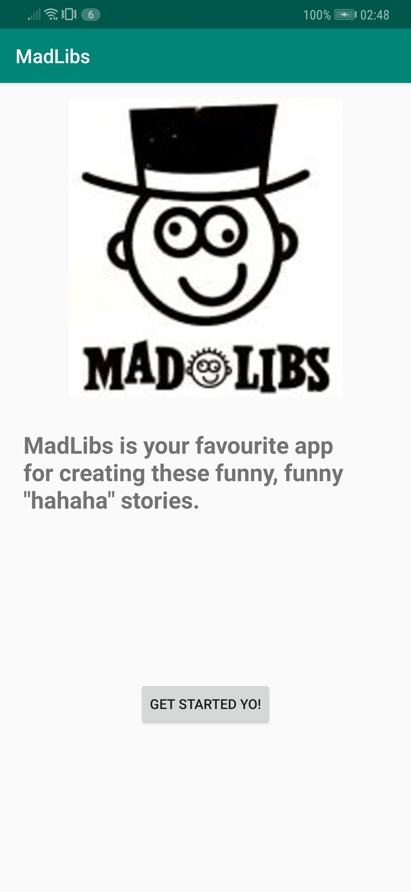
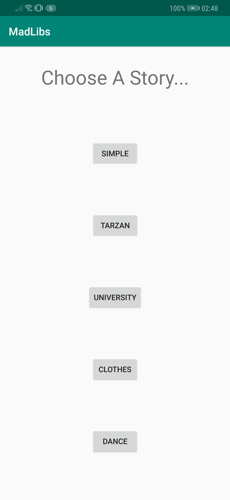
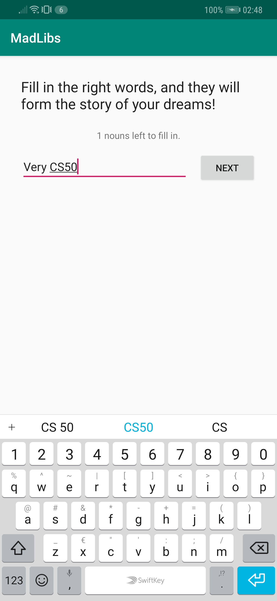
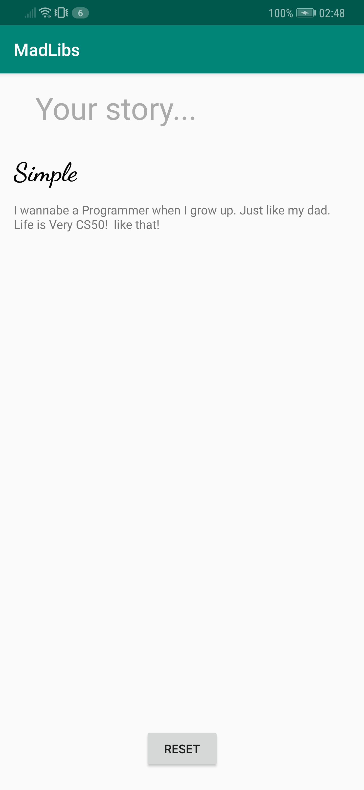

# MadLibs
A short description of the app Journal.

## Getting Started
### Prerequisites
The app is created in Android-Studio, it is currently made for API 24 Nougat (Android 7.0), but also confirmed running on API 28 Pie (Android 9.0).
An android phone with either one of those Android versions (and most likely the versions in between) will suffice.

## Test
When launching the app, a screen appears showing the start screen of the app. Here the user can click on the "GET STARTED YO!" button to be taken to the next screen. Here the user can choose a story that they want to use for their Mad Libs.

 

After a story has been clicked on, the next screen will appear: the input screen. The user will be asked to fill in placeholders for their story. Clicking "NEXT" will take the user to the next placeholder, until all placeholders have been filled.

When all placeholders have been filled, the resulting story will be shown.

## Author
* Me

## Acknowledgements
* Renske Talsma
* Natasja Wezel
